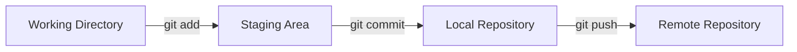
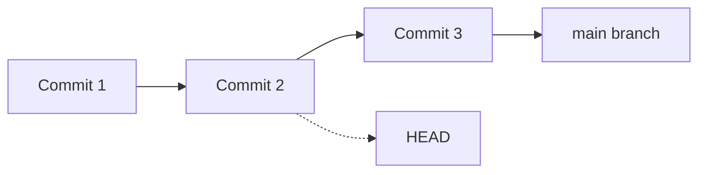
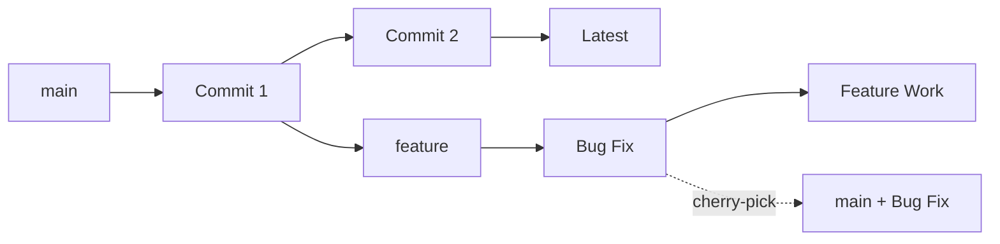
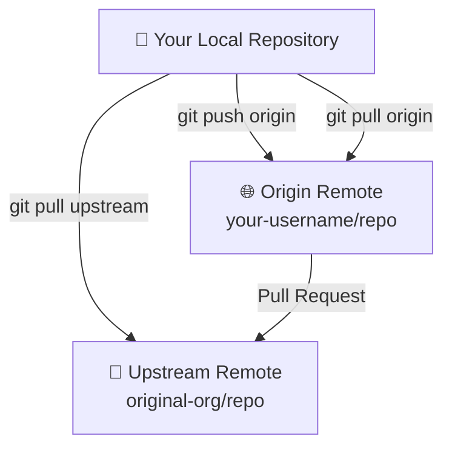
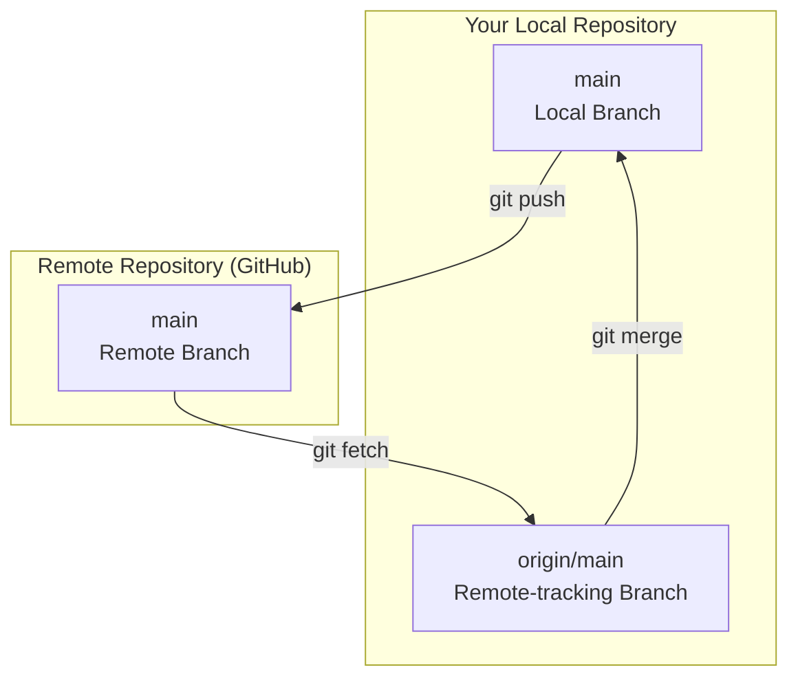

Git Interview Questions - Complete Guide

A comprehensive collection of 30 Git interview questions with detailed answers, examples, and command references - from beginner to advanced level.

📚 Table of Contents

🟢 Beginner Level (1-10)
🟡 Intermediate Level (11-20)
🔴 Advanced Level (21-30)
📋 Quick Command Reference
🎯 Interview Tips
🤝 Contributing
📄 License


## 🟢 Beginner Level Questions 

### GitHub interaction (remote platform)
```
git remote add origin https://github.com/username/repo.git
git push -u origin main
```
---
### Q3: What are the basic Git commands you use daily?
Answer:
#### Essential Daily Commands:
```bash
#📊 Check repository status
git status

# ➕ Stage changes
git add .                    # Stage all files
git add filename.txt         # Stage specific file

# 💾 Commit changes  
git commit -m "Add new feature"

# ⬆️ Push to remote
git push origin main

# ⬇️ Pull latest changes
git pull origin main

# 📜 View commit history
git log --oneline

# 🔄 Switch branches
git checkout branch-name
git switch branch-name       # Modern alternative
```
---
### Q4: What is the purpose of git init?
Answer:

`git init` initializes a new Git repository in the current directory by creating the .git folder containing all repository metadata.
Example:
```bash
# Create new project directory
mkdir my-awesome-project
cd my-awesome-project

# Initialize Git repository
git init

# Output: Initialized empty Git repository in /path/to/my-awesome-project/.git/


# Verify initialization
ls -la
# Shows: .git/ directory created

# Check repository status
git status
# Output: On branch main (No commits yet)
```

---

### Q5: Explain the difference between `git add`, `git commit`, and `git push`.
Answer:
These commands represent the three-stage Git workflow:

#### 🔧 git add - Stages changes to the staging area
```
git add index.html           # Stage specific file
git add .                    # Stage all changes
git add *.js                 # Stage all JavaScript files
```
#### 💾 git commit - Records staged changes to local repository
```bash
git commit -m "Fix navigation bug"
git commit -am "Quick fix"   # Stage and commit tracked files
```
#### ⬆️ git push - Uploads local commits to remote repository

```bash
git push origin main         # Push to main branch
git push -u origin feature   # Push and set upstream
```
---

### Q6: What does git status show?
Answer:
git status displays the current state of the working directory and staging area.
Example Output:
```bash
git status

#### 📋 Sample output:
On branch main
Your branch is up to date with 'origin/main'.

Changes to be committed:
  (use "git restore --staged <file>..." to unstage)
        🟢 modified:   index.html
        🆕 new file:   style.css

Changes not staged for commit:
  (use "git add <file>..." to update what will be committed)
        🟡 modified:   script.js

Untracked files:
  (use "git add <file>..." to include in what will be committed)
        🔴 README.md
```
Status Legend:
- 🟢 Green = Staged (ready to commit)
- 🟡 Yellow = Modified but not staged
- 🔴 Red = Untracked files


---
### Q7: How do you create a new branch in Git?
Answer:
Three methods to create branches:
```bash
# Method 1: Create branch only
git branch feature-login

# Method 2: Create and switch (recommended) 
git checkout -b feature-login

# Method 3: Modern syntax (Git 2.23+)
git switch -c feature-login

# 📋 Verify branch creation
git branch
# Output: 
#   main
# * feature-login  ← Current branch
```
#### Branch Naming Conventions:
```bash
git checkout -b feature/user-authentication
git checkout -b bugfix/login-validation
git checkout -b hotfix/security-patch
git checkout -b release/v1.2.0
```
---

### Q8: How do you switch between branches?
Answer:
Multiple ways to switch branches:
```bash
# 🔄 Traditional method
git checkout main
git checkout feature-branch

# 🆕 Modern method (Git 2.23+)
git switch main
git switch feature-branch

# ⏪ Switch to previous branch
git switch -
git checkout -

# 📋 List all branches
git branch -a
# Output:
# * main
#   feature-login
#   remotes/origin/main
#   remotes/origin/develop
```
---
### Q9: What is a merge conflict? How do you resolve it?
Answer:
A merge conflict occurs when Git cannot automatically merge changes from different branches that modify the same lines.
#### 🔥 Conflict Resolution Process:
```bash
# 1. Attempt merge
git checkout main
git merge feature-branch
# ⚠️  CONFLICT (content): Merge conflict in index.html

# 2. Check status
git status
# Shows files with conflicts

# 3. Open conflicted file - Git adds conflict markers:
```
#### Conflict markers in file:

```html
html<<<<<<< HEAD
<h1>Welcome to Main Branch</h1>
=======
<h1>Welcome to Feature Branch</h1>  
>>>>>>> feature-branch
```

#### Resolution steps:
```bash
# 4. Edit file to resolve conflict:
<h1>Welcome to Our Amazing Website</h1>

# 5. Stage resolved file
git add index.html

# 6. Complete merge
git commit -m "Resolve merge conflict in header"
```
---
### Q10: Explain git clone vs git pull.
Answer:
|Command|Purpose|Usage|
|:---:|:---:|:---:|
|`git clone`|📥 Creates complete local copy|First-time setup|
|`git pull`|⬇️ Updates existing repository|Regular updates|

#### Examples:
```bash
# 📥 git clone - First time setup
git clone https://github.com/username/awesome-project.git
cd awesome-project
# Now you have complete repository locally

# ⬇️ git pull - Update existing repo  
cd existing-project
git pull origin main

# git pull is equivalent to:
git fetch origin    # Download changes
git merge origin/main  # Merge changes
```
---
<br>

## 🟡 Intermediate Level Questions (11-20)

### Q11: What is the difference between git fetch and git pull?
Answer:
CommandWhat it doesSafetyUse casegit fetch📥 Downloads changes only✅ SafeReview before merginggit pull📥➕ Downloads + merges⚠️ Can cause conflictsQuick updates
Examples:
```bash
# 🔍 git fetch - Safe exploration
git fetch origin
git log HEAD..origin/main    # See what's new
git diff HEAD origin/main    # See changes  
git merge origin/main        # Merge when ready

# ⚡ git pull - Quick update
git pull origin main

# 🔄 git pull with rebase (cleaner history)
git pull --rebase origin main
```
---
### Q12: How does ``git rebase`` differ from ``git merge``?
Answer:
Visual Comparison:
```
Before:
    A---B---C feature
   /
  D---E---F---G main

After MERGE:          After REBASE:
    A---B---C feature     D---E---F---G---A'---B'---C' feature
   /         \           /
  D---E---F---G---H main D---E---F---G main
```

| Aspect | Merge | Rebase |
|:---:|:---:|:---:|
| History | Preserves branch history|Creates linear history|
|Commits| Creates merge commit| Replays commits|
|Safety| ✅ Non-destructive| ⚠️ Rewrites history|

Examples:
```
# 🌿 Merge approach
git checkout main
git merge feature-branch
# Creates merge commit


# 📏 Rebase approach  
git checkout feature-branch
git rebase main
git checkout main
git merge feature-branch  # Fast-forward merge

# 🎛️ Interactive rebase
git rebase -i HEAD~3  # Edit last 3 commits
```
---
### Q13: What is the use of .gitignore?
Answer:
.gitignore specifies intentionally untracked files that Git should ignore.

📁 Example .gitignore:
```# Create .gitignore
touch .gitignore
gitignore# 📝 Logs and databases
*.log
*.sql
*.sqlite

# 📦 Dependencies  
node_modules/
vendor/
.env
.env.local

# 🔧 IDE and editor files
.vscode/
.idea/
*.swp
*.swo

# 💻 Operating System
.DS_Store      # macOS
Thumbs.db      # Windows
desktop.ini

# 🏗️ Build outputs
dist/
build/
*.min.js
*.min.css

# 🧪 Test coverage
coverage/
.nyc_output/

# 🔐 Security
*.pem
*.key
config/secrets.yml
Useful commands:
bash# Check what would be ignored
git check-ignore -v filename

# Force add ignored file
git add -f ignored-file.txt

# Remove already tracked file and ignore it
git rm --cached file-to-ignore.txt
echo "file-to-ignore.txt" >> .gitignore
```
---
### Q14: What is a detached HEAD in Git?
Answer:
Detached HEAD occurs when you checkout a specific commit instead of a branch reference.

Example:

```
# 📜 View commit history
git log --oneline
# abc1234 (HEAD -> main) Latest commit
# def5678 Previous commit  
# ghi9012 Initial commit

# 🎯 Create detached HEAD state
git checkout def5678
# ⚠️  Warning: You are in 'detached HEAD' state

# 📊 Check current state
git status
# HEAD detached at def5678

# 🔧 Fix detached HEAD:

# Option 1: Create branch from current state
git checkout -b fix-from-old-commit

# Option 2: Return to main branch  
git checkout main
```
⚠️ Warning Signs:
- Terminal shows commit hash instead of branch name
- git status mentions "detached HEAD"
- New commits won't belong to any branch

---
### Q15: How do you revert a commit?
Answer:
``git revert`` creates a new commit that undoes changes from a previous commit. It's safe for shared repositories.

```
# 📜 Find commits to revert
git log --oneline
# abc1234 (HEAD -> main) Bug introduced here
# def5678 Good commit
# ghi9012 Another good commit

# ↩️ Revert last commit
git revert HEAD
# Creates new commit undoing HEAD

# ↩️ Revert specific commit
git revert abc1234

# 📝 Revert with custom message
git revert HEAD -m "Revert problematic feature"

# 🎛️ Revert without auto-commit
git revert --no-commit HEAD
# Make additional changes
git commit -m "Revert and fix issue"

# 🔄 Revert range of commits
git revert HEAD~3..HEAD

# 📋 Revert merge commit (specify parent)
git revert -m 1 abc1234
vs git reset:
CommandUse caseSafetygit revert🌐 Shared repositories✅ Safegit reset💻 Local changes only⚠️ Destructive
```
---
### Q16: How do you squash commits?
Answer:
Squashing combines multiple commits into a single commit for cleaner history.
#### Method 1: Interactive Rebase
```
# 🎛️ Squash last 3 commits
git rebase -i HEAD~3

# 📝 Editor opens with:
pick abc1234 First commit message
pick def5678 Second commit message  
pick ghi9012 Third commit message

# ✏️ Change to:
pick abc1234 First commit message
squash def5678 Second commit message
squash ghi9012 Third commit message

# 💾 Save and edit combined commit message:
Feature: Complete login system

- Add login form validation
- Implement user authentication  
- Add password hashing
```

#### Method 2: Soft Reset
```# 🔄 Reset to 3 commits ago (keep changes)
git reset --soft HEAD~3

# 💾 Create new single commit
git commit -m "Feature: Complete login system with validation"
```

#### Method 3: Squash Merge
```
# 🌿 Squash entire feature branch
git checkout main
git merge --squash feature-branch
git commit -m "Add complete login feature"
```
---

### Q17: Explain git stash and how to use it.
Answer:
``git stash`` temporarily saves uncommitted changes so you can work on something else.

💾 Basic Stashing:
```
# 📦 Stash current changes
git stash
# or with descriptive message
git stash push -m "Work in progress on login feature"

# 📋 List all stashes
git stash list
# stash@{0}: WIP on main: abc1234 Work in progress on login feature
# stash@{1}: On main: abc1234 Last commit message

# 🔄 Apply latest stash (keeps stash)
git stash apply

# 📤 Apply and remove latest stash  
git stash pop

# 🎯 Apply specific stash
git stash apply stash@{1}
```

🎛️ Advanced Stashing:
```
# 📁 Stash specific files
git stash push -m "Stash config files" config.json settings.yaml

# 📋 Show stash contents
git stash show -p stash@{0}

# 🗑️ Drop specific stash
git stash drop stash@{0}

# 🧹 Clear all stashes
git stash clear

# 🌿 Create branch from stash
git stash branch feature-stash stash@{0}
Use Cases:

🚨 Emergency bug fixes
🔄 Switch contexts quickly
🧪 Experimental changes
📦 Temporary storage
```
---
### Q18: What is the difference between `git reset`, `git checkout`, and `git revert`?

#### Answer:
|Command| Scope|Safety|Use Case|
|:---:|:---:|:---:|:---:|
|git reset| Moves HEAD & branch|⚠️ Can be destructive|Undo local commits|
|git checkout| Moves HEAD only| ✅ Safe| Switch branches/restore files|
|git revert|Creates new commit|✅ Safe for shared repos|Undo public commits|

#### 🎛️ git reset modes:
```bash
# 🽃 Soft reset (keep changes staged)
git reset --soft HEAD~1

# 📝 Mixed reset (keep changes unstaged) - DEFAULT
git reset HEAD~1  
git reset --mixed HEAD~1

# 💥 Hard reset (discard all changes) - DANGEROUS!
git reset --hard HEAD~1
```
#### 🔄 git checkout uses:
```bash
# 🌿 Switch branches
git checkout main
git checkout feature-branch

# 🎯 Checkout specific commit (detached HEAD)
git checkout abc1234

# 📄 Restore file from HEAD
git checkout -- file.txt
git checkout HEAD -- file.txt

# 📄 Restore file from specific commit  
git checkout abc1234 -- file.txt
```
#### ↩️ git revert examples:
```bash
# ✅ Safe for shared repositories
git revert HEAD           # Revert last commit
git revert abc1234        # Revert specific commit
git revert --no-commit HEAD  # Revert but don't commit yet
```
---
### Q19: How can you view commit history in Git?
#### Answer:
📜 Basic History Commands:
```bash
# 📋 Standard log
git log

# 📏 Compact one-line format
git log --oneline

# 🌳 Visual graph with branches
git log --graph --oneline --all

# 📊 Show file statistics
git log --stat

# 🔍 Show actual changes
git log -p
```
#### 🎛️ Advanced Filtering:
```bash
# 📅 Filter by date
git log --since="2024-01-01" --until="2024-12-31"
git log --since="2 weeks ago"

# 👤 Filter by author
git log --author="John Doe"
git log --author="john@example.com"

# 🔍 Search commit messages
git log --grep="bug fix"
git log --grep="feature" --grep="login" --all-match

# 📄 Show commits affecting specific file
git log -- filename.txt
git log --follow -- filename.txt  # Follow renames

# 📊 Limit number of commits
git log -5                    # Last 5 commits
git log --max-count=10        # Last 10 commits
```

#### 🎨 Pretty Formatting:
```bash
# 🎨 Custom format
git log --pretty=format:"%h %an %ar %s"
# Output: abc1234 John Doe 2 hours ago Fix login bug

# 📋 Predefined formats
git log --pretty=short
git log --pretty=full
git log --pretty=fuller

# 🌈 Color output
git log --oneline --decorate --graph --all

# 📊 Show merge commits only
git log --merges

# 📊 Hide merge commits  
git log --no-merges
```
#### Useful aliases:
```bash
git config --global alias.lg "log --oneline --decorate --graph --all"
git config --global alias.hist "log --pretty=format:'%h %ad | %s%d [%an]' --graph --date=short"
```
---
### Q20: What is cherry-picking in Git?
### Answer:
Cherry-picking applies a specific commit from one branch to another without merging the entire branch.

#### 🍒 Basic Cherry-picking:
```bash
# 🔍 Find commit to cherry-pick
git log --oneline feature-branch
# abc1234 Fix critical security bug
# def5678 Add new feature  
# ghi9012 Update documentation

# 🌿 Switch to target branch
git checkout main

# 🍒 Cherry-pick specific commit
git cherry-pick abc1234
# This applies only the security bug fix to main
```
#### 🎛️ Advanced Cherry-picking:
```bash
# 🍒 Cherry-pick without auto-commit
git cherry-pick --no-commit abc1234
# Make additional changes
git commit -m "Cherry-pick security fix with modifications"

# 🍒 Cherry-pick range of commits
git cherry-pick abc1234^..def5678

# 🍒 Cherry-pick with custom commit message
git cherry-pick abc1234 --edit

# 🔧 Resolve conflicts during cherry-pick
git cherry-pick abc1234
# Fix conflicts in files
git add .
git cherry-pick --continue

# ❌ Abort cherry-pick
git cherry-pick --abort
```
#### 🎯 Use Cases:
- 🚨 Hotfixes: Apply critical fixes to production
- 🧪 Feature testing: Test specific features in different branches
- 📦 Selective deployment: Include only specific changes
- 🔄 Cross-branch fixes: Apply fixes across multiple versions
---
---
## 🔴 Advanced Level Questions (21-30)
###Q21: What is Git interactive rebase (git rebase -i) and when do you use it?
#### Answer:
Interactive rebase allows you to modify commit history by editing, reordering, squashing, or dropping commits.
#### 🎛️ Available Commands:
```bash
# Start interactive rebase
git rebase -i HEAD~4

# Editor opens with commit list and options:
pick abc1234 Add login feature
pick def5678 Fix typo in login  
pick ghi9012 Add input validation
pick jkl3456 Update tests

# Available commands:
# p, pick   = use commit as-is
# r, reword = use commit, but edit message  
# e, edit   = use commit, but stop for amending
# s, squash = use commit, but meld into previous
# f, fixup  = like squash, but discard message
# d, drop   = remove commit
```

🛠️ Common Operations:
#### 1. Squash commits:
```bash
pick abc1234 Add login feature
fixup def5678 Fix typo in login    # Squash without message
squash ghi9012 Add input validation # Squash with message edit
pick jkl3456 Update tests
```
#### 2. Reorder commits:
```bash
pick jkl3456 Update tests          # Move tests first
pick abc1234 Add login feature  
pick ghi9012 Add input validation
drop def5678 Fix typo in login     # Remove this commit
```
#### 3. Edit commit:
```bash
edit abc1234 Add login feature     # Stop here for editing
pick ghi9012 Add input validation
pick jkl3456 Update tests

# When stopped at 'edit':
# Make changes to files
git add modified-file.js
git commit --amend
git rebase --continue
```
#### ⚠️ When NOT to use:

- 🌐 Never rebase shared/public commits
- 👥 Avoid on branches others are working on
- 📦 Don't rebase if pushed to remote
---

### Q22: How do you resolve conflicts after a rebase?
#### Answer:
Rebase conflicts are resolved similarly to merge conflicts, but you continue the rebase process afterward.

#### 🔥 Conflict Resolution Process:
```bash
# 1. 🚀 Start rebase
git checkout feature-branch  
git rebase main
# ⚠️ CONFLICT (content): Merge conflict in src/app.js

# 2. 📊 Check status
git status
# Rebase in progress; onto abc1234
# You are currently rebasing branch 'feature-branch' on 'abc1234'
# Unmerged paths: src/app.js

# 3. 📝 View conflict markers in file:
```
```javascript
function authenticateUser(username, password) {
<<<<<<< HEAD
    // Code from main branch
    return validateCredentials(username, password);
=======
    // Code from feature branch  
    return checkUserCredentials(username, password);
>>>>>>> abc1234 (Add authentication feature)
}
```
```bash
# 4. ✏️ Resolve conflicts manually:
function authenticateUser(username, password) {
    // Combined solution
    const isValid = validateCredentials(username, password);
    return checkUserCredentials(username, password, isValid);
}

# 5. ➕ Stage resolved files
git add src/app.js

# 6. ⏭️ Continue rebase
git rebase --continue

# If more conflicts occur, repeat steps 3-6
```

#### 🛠️ Rebase Commands:
```bash
# ⏭️ Continue after resolving conflicts
git rebase --continue

# ⏭️ Skip current commit (if problematic)
git rebase --skip

# ❌ Abort rebase (return to original state)  
git rebase --abort

# 🔍 Show current rebase status
git status
```

#### 💡 Pro Tips:
```bash
# 🎯 Use mergetool for complex conflicts
git mergetool

# 📊 Show conflict summary
git diff --name-status

# 🔍 See what's being rebased
git log --oneline HEAD..feature-branch
```
---
### Q23: How do you handle large binary files in Git?
#### Answer:
Git LFS (Large File Storage) is the solution for handling large binary files efficiently.
#### 🚀 Setup Git LFS:
```bash
# 📦 Install Git LFS (if not already installed)
git lfs install

# 🎯 Track specific file types
git lfs track "*.pdf"
git lfs track "*.zip" 
git lfs track "*.mp4"
git lfs track "*.psd"
git lfs track "*.ai"

# 🎯 Track files by size (files over 100MB)
git lfs track "*.* filter=lfs diff=lfs merge=lfs -text"

# 📋 View tracked patterns
git lfs track
# Listing tracked patterns
#     *.pdf (.gitattributes)
#     *.mp4 (.gitattributes)
```

#### 📁 Working with LFS files:
```bash
# ✅ .gitattributes file created automatically
cat .gitattributes
# *.pdf filter=lfs diff=lfs merge=lfs -text
# *.mp4 filter=lfs diff=lfs merge=lfs -text

# ➕ Add .gitattributes to repository  
git add .gitattributes
git commit -m "Configure Git LFS tracking"

# ➕ Add large files normally
git add presentation.pdf
git add demo-video.mp4
git commit -m "Add presentation materials"

# ⬆️ Push with LFS
git push origin main
```

#### 🔍 LFS Management:
```bash
# 📊 Show LFS files in repository
git lfs ls-files

# 📊 Show LFS storage usage
git lfs env

# 🔄 Clone repository with LFS
git lfs clone https://github.com/user/repo.git

# 📥 Pull LFS files for existing repo
git lfs pull

# 🧹 Clean up LFS cache  
git lfs prune

# 📋 Show LFS file info
git lfs pointer --file=large-video.mp4
```
#### Alternative Solutions:
```bash
# 🔧 Git Annex (for distributed storage)
git annex add large-dataset.zip

# ☁️ Store large files externally and reference
echo "https://cdn.example.com/large-file.zip" > large-file.url
git add large-file.url
```
---

### Q24: How do you undo a pushed commit?
#### Answer:
Different approaches depending on collaboration and safety requirements:
#### ✅ Safe Method: git revert (Recommended)
```bash
# 📜 Find problematic commit
git log --oneline
# abc1234 (HEAD -> main) Bad commit that broke production
# def5678 Good commit
# ghi9012 Another good commit

# ↩️ Revert the bad commit (creates new commit)
git revert abc1234
git push origin main

# ↩️ Revert multiple commits
git revert HEAD~2..HEAD  # Revert last 2 commits
git push origin main
```

#### ⚠️ Destructive Method: git reset + Force Push
```bash
# 🚨 DANGER: Only use if you're sure no one else pulled the commit

# 🔄 Reset to previous commit
git reset --hard HEAD~1
# or reset to specific commit
git reset --hard def5678

# 💥 Force push (overwrites remote history)
git push --force-with-lease origin main

# 🛡️ Safer force push (checks remote state first)
git push --force-with-lease origin main
```
#### 🎯 Interactive Approach:
```bash
# 📝 Use interactive rebase to edit history
git rebase -i HEAD~3

# In editor, mark commits to drop or edit:
pick def5678 Good commit  
drop abc1234 Bad commit    # Remove this commit
pick ghi9012 Another good commit

# 💥 Force push after rebase
git push --force-with-lease origin main
```
#### 🔧 Specific File Revert:
```bash
# ↩️ Revert specific file to previous state
git checkout HEAD~1 -- problematic-file.js
git commit -m "Revert problematic-file.js to previous version"
git push origin main
```
#### ⚠️ Safety Guidelines:
- ✅ Use git revert for shared repositories
- ⚠️ Use git reset + force push only for private branches
- 📢 Communicate with team before rewriting shared history
- 🛡️ Use --force-with-lease instead of --force
- 💾 Create backup branch before destructive operations

```bash
# 💾 Create backup before dangerous operations
git branch backup-before-reset
git reset --hard HEAD~1
git push --force-with-lease origin main
```
---
### Q25: What are Git hooks?
#### Answer:
Git hooks are scripts that run automatically at specific points in the Git workflow.
#### 📂 Hook Location:
```bash
# Navigate to hooks directory
cd .git/hooks/

# List available hooks (sample files)
ls -la
# pre-commit.sample
# post-commit.sample  
# pre-push.sample
# post-receive.sample
```
#### 🔧 Common Client-Side Hooks:
##### 1. pre-commit - Runs before commit
```bash
#!/bin/sh
# .git/hooks/pre-commit

# Prevent commits with TODO comments
if git diff --cached | grep -i "TODO"; then
    echo "❌ Commit contains TODO - please resolve first"
    exit 1
fi

# Run tests before commit
npm test
if [ $? -ne 0 ]; then
    echo "❌ Tests failed - commit aborted"
    exit 1
fi

echo "✅ Pre-commit checks passed"
```

##### 2. commit-msg - Validates commit messages
```bash
#!/bin/sh
# .git/hooks/commit-msg

# Enforce commit message format
commit_regex='^(feat|fix|docs|style|refactor|test|chore)(\(.+\))?: .{1,50}'

if ! grep -qE "$commit_regex" "$1"; then
    echo "❌ Invalid commit message format!"
    echo "Use: type(scope): description"
    echo "Example: feat(auth): add login validation"
    exit 1
fi

echo "✅ Commit message format is valid"
```
##### 3. pre-push - Runs before push
```bash
#!/bin/sh
# .git/hooks/pre-push

protected_branch='main'
current_branch=$(git symbolic-ref HEAD | sed -e 's,.*/\(.*\),\1,')

if [ $protected_branch = $current_branch ]; then
    echo "❌ Direct push to $protected_branch branch is not allowed"
    echo "Please create a pull request instead"
    exit 1
fi

echo "✅ Push to $current_branch allowed"
```
#### 🖥️ Server-Side Hooks:
post-receive - Runs after push (on server)
```bash
#!/bin/sh
# Automatic deployment after push

while read oldrev newrev refname; do
    if [[ $refname = "refs/heads/main" ]]; then
        echo "🚀 Deploying to production..."
        cd /var/www/app
        git --git-dir=/var/www/app/.git --work-tree=/var/www/app pull origin main
        npm install
        npm run build
        systemctl reload nginx
        echo "✅ Deployment complete"
    fi
done
```
#### 🛠️ Hook Management:
```bash
# Make hook executable
chmod +x .git/hooks/pre-commit

# Test hook manually
.git/hooks/pre-commit

# Disable hook temporarily (rename it)
mv .git/hooks/pre-commit .git/hooks/pre-commit.disabled

# Share hooks with team (using symbolic links)
mkdir .githooks
mv .git/hooks/pre-commit .githooks/
ln -s ../../.githooks/pre-commit .git/hooks/pre-commit

# Configure hooks directory for team
git config core.hooksPath .githooks
```
---

### Q26: How do you configure Git in a CI/CD pipeline?
#### Answer:
CI/CD Git configuration involves setting up authentication, user identity, and automation-friendly settings.
#### 🐙 GitHub Actions Example:
```yaml
name: CI/CD Pipeline
on: 
  push:
    branches: [main, develop]
  pull_request:
    branches: [main]

jobs:
  build-and-deploy:
    runs-on: ubuntu-latest
    
    steps:
      - name: 📥 Checkout code
        uses: actions/checkout@v4
        with:
          fetch-depth: 0  # Full history for proper versioning
          token: ${{ secrets.GITHUB_TOKEN }}
          
      - name: 🔧 Configure Git
        run: |
          git config --global user.name "CI Bot"
          git config --global user.email "ci-bot@company.com"
          git config --global init.defaultBranch main
          
      - name: 🔐 Setup Git credentials  
        run: |
          git config --global credential.helper store
          echo "https://x-access-token:${{ secrets.GITHUB_TOKEN }}@github.com" > ~/.git-credentials
          
      - name: 🏷️ Create release tag
        if: github.ref == 'refs/heads/main'
        run: |
          VERSION=$(date +%Y%m%d%H%M%S)
          git tag "v$VERSION"
          git push origin "v$VERSION"
          
      - name: 📦 Build and test
        run: |
          npm install
          npm run build
          npm test
```

#### 🦊 GitLab CI Example:
```yaml
# .gitlab-ci.yml
stages:
  - build
  - test  
  - deploy

variables:
  GIT_DEPTH: 0
  GIT_STRATEGY: clone

before_script:
  - git config --global user.name "GitLab CI"
  - git config --global user.email "ci@company.com"
  
build:
  stage: build
  script:
    - git fetch --tags
    - VERSION=$(git describe --tags --always)
    - echo "Building version $VERSION"
    - npm install
    - npm run build
    
deploy:
  stage: deploy
  only:
    - main
  script:
    - git checkout main
    - git pull origin main
    - ./deploy.sh
    - git tag "release-$(date +%Y%m%d-%H%M%S)"
    - git push origin --tags
``` 
#### 🔐 SSH Key Setup for CI:
```bash
# Generate SSH key for CI
ssh-keygen -t ed25519 -C "ci@company.com" -f ci_key

# Add public key to GitHub/GitLab deploy keys
cat ci_key.pub

# In CI environment, add private key as secret
# Then configure SSH:
mkdir -p ~/.ssh
echo "$SSH_PRIVATE_KEY" > ~/.ssh/id_ed25519
chmod 600 ~/.ssh/id_ed25519
ssh-keyscan github.com >> ~/.ssh/known_hosts

# Test SSH connection
ssh -T git@github.com
```
#### 🐳 Docker CI Setup:
```dockerfile
FROM node:18-alpine

# Install Git
RUN apk add --no-cache git

# Configure Git for CI
RUN git config --global user.name "Docker CI" && \
    git config --global user.email "ci@company.com" && \
    git config --global init.defaultBranch main

# Set working directory
WORKDIR /app

# Copy and install dependencies
COPY package*.json ./
RUN npm install

# Copy source code
COPY . .

# Build application
RUN npm run build
```

#### 🔧 Common CI Git Commands:
```bash
# Shallow clone for faster CI
git clone --depth=1 https://github.com/user/repo.git

# Get version from Git
VERSION=$(git describe --tags --always --dirty)

# Check if branch exists
git show-branch remotes/origin/feature-branch

# Auto-commit CI changes
if [[ -n $(git status --porcelain) ]]; then
    git add .
    git commit -m "CI: Auto-update dependencies [skip ci]"
    git push origin main
fi
```
---
### Q27: What's the difference between local, remote, and upstream branches?
#### Answer:
Branch types represent different contexts in distributed Git workflow:

#### 📍 Local Branches - Exist on your machine
```bash
# 📋 List local branches
git branch
# * main
#   feature-login
#   bugfix-auth

# 🔧 Work with local branches
git checkout feature-login
git commit -m "Add validation"
```
#### 🌐 Remote Branches - References to branches on remote servers
```bash
# 📋 List remote branches  
git branch -r
# origin/main
# origin/feature-login
# origin/develop

# 📋 List all branches (local + remote)
git branch -a
# * main
#   feature-login  
#   remotes/origin/main
#   remotes/origin/feature-login
```
#### ⬆️ Upstream Branches - The branch your local branch tracks
```bash
# 📊 Show tracking relationships
git branch -vv
# * main         abc1234 [origin/main] Latest commit
#   feature-login def5678 [origin/feature-login: ahead 2] Work in progress

# 🔗 Set upstream for existing branch
git branch --set-upstream-to=origin/main main

# 🔗 Set upstream when pushing
git push -u origin feature-login

# 📊 Check upstream status
git status
# On branch feature-login
# Your branch is ahead of 'origin/feature-login' by 2 commits
```
#### 🔧 Managing Remote Branches:
```bash
# ➕ Add new remote
git remote add upstream https://github.com/original-org/repo.git

# 📋 List remotes
git remote -v
# origin    https://github.com/your-username/repo.git (fetch)
# origin    https://github.com/your-username/repo.git (push)  
# upstream  https://github.com/original-org/repo.git (fetch)
# upstream  https://github.com/original-org/repo.git (push)

# 📥 Fetch from upstream
git fetch upstream

# 🔄 Sync with upstream
git checkout main
git pull upstream main
git push origin main
```
#### 🎯 Common Workflow (Fork + Pull Request):
```bash
# 1. 🍴 Fork repository on GitHub
# 2. 📥 Clone your fork
git clone https://github.com/your-username/repo.git
cd repo

# 3. ➕ Add upstream remote
git remote add upstream https://github.com/original-org/repo.git

# 4. 🌿 Create feature branch
git checkout -b feature-awesome-feature

# 5. 💾 Make changes and commit
git commit -m "Add awesome feature"

# 6. ⬆️ Push to your fork
git push -u origin feature-awesome-feature

# 7. 🔄 Keep updated with upstream
git fetch upstream
git checkout main  
git merge upstream/main
git push origin main

# 8. 🔄 Update feature branch with latest main
git checkout feature-awesome-feature
git merge main
git push origin feature-awesome-feature
```
---

### Q28: How do you clean up a Git repository (e.g., remove old branches, large files)?
#### Answer:
Repository cleanup involves removing unnecessary branches, files, and optimizing storage.
#### 🌿 Branch Cleanup:
```bash
# 📋 List merged branches (safe to delete)
git branch --merged main | grep -v "\*\|main\|develop"

# 🗑️ Delete local merged branches
git branch --merged main | grep -v "\*\|main\|develop" | xargs -n 1 git branch -d

# 🗑️ Delete remote tracking branches that no longer exist
git remote prune origin

# 🗑️ Force delete unmerged branch (be careful!)
git branch -D feature-abandoned

# 📋 List remote branches merged into main
git branch -r --merged origin/main | grep -v "main\|develop" | sed 's/origin\///'

# 🗑️ Delete remote branch
git push origin --delete feature-old-branch
```
#### 🧹 File and History Cleanup:
```bash
# 🔍 Find large files in repository
git rev-list --objects --all | git cat-file --batch-check='%(objecttype) %(objectname) %(objectsize) %(rest)' | sed -n 's/^blob //p' | sort --numeric-sort --key=2 | tail -10

# 🗑️ Remove large file from history (DESTRUCTIVE!)
git filter-branch --force --index-filter \
  'git rm --cached --ignore-unmatch path/to/large-file.zip' \
  --prune-empty --tag-name-filter cat -- --all

# 🧹 Alternative: Use BFG Repo-Cleaner (faster)
java -jar bfg.jar --delete-files large-file.zip .git
java -jar bfg.jar --strip-blobs-bigger-than 50M .git

# 🧹 Clean up after BFG
git reflog expire --expire=now --all
git gc --prune=now --aggressive

# 🗑️ Remove sensitive data from history
git filter-branch --force --index-filter \
  'git rm --cached --ignore-unmatch config/secrets.yml' \
  --prune-empty -- --all
  ```

#### 🔧 Repository Optimization:
```bash
# 🧹 Garbage collection (clean up unreachable objects)
git gc --aggressive --prune=now

# 📊 Check repository size
git count-objects -vH
# count 245
# size 1.67 MiB
# in-pack 1032  
# packs 1
# size-pack 2.87 MiB

# 🧹 Clean working directory
git clean -fd              # Remove untracked files and directories
git clean -fX              # Remove ignored files
git clean -fx              # Remove untracked and ignored files

# 🔧 Repack repository for better compression
git repack -a -d --depth=250 --window=250

# 📊 Verify repository integrity
git fsck --full
```
#### 🎯 Automated Cleanup Script:
```bash
#!/bin/bash
# cleanup-repo.sh

echo "🧹 Starting Git repository cleanup..."

# Delete merged branches
echo "🗑️  Deleting merged branches..."
git branch --merged main | grep -v "\*\|main\|develop" | xargs -n 1 git branch -d

# Prune remote tracking branches
echo "🌐 Pruning remote tracking branches..."
git remote prune origin

# Clean untracked files
echo "📁 Cleaning untracked files..."
git clean -fd

# Garbage collection
echo "🗑️  Running garbage collection..."
git gc --aggressive --prune=now

# Show final stats
echo "📊 Repository statistics:"
git count-objects -vH

echo "✅ Cleanup complete!"
```
#### ⚠️ Safety Checklist:
- 💾 Create backup before destructive operations
- 📢 Coordinate with team before cleaning shared repositories
- 🧪 Test in clone before running on main repository
- 📋 Document changes for team awareness

---

### Q29: Explain the concept of Git reflog.
#### Answer:
Git reflog is a mechanism that records when the tips of branches and other references were updated in the local repository.
#### 🔍 What Reflog Tracks:
- Every time HEAD moves
- Branch creation/deletion
- Commits, merges, rebases
- Checkouts, resets
- Any reference updates

```bash
# 📋 View reflog for HEAD
git reflog
# abc1234 HEAD@{0}: commit: Add user authentication
# def5678 HEAD@{1}: checkout: moving from main to feature-branch  
# ghi9012 HEAD@{2}: reset: moving to HEAD~1
# jkl3456 HEAD@{3}: commit: Fix navigation bug
# mno7890 HEAD@{4}: pull: Fast-forward

# 📋 View reflog for specific branch
git reflog show main
git reflog show feature-branch

# 📅 View reflog with timestamps
git reflog --date=relative
# abc1234 HEAD@{0}: commit: Add user authentication (2 hours ago)
# def5678 HEAD@{1}: checkout: moving from main to feature (3 hours ago)

# 📅 Absolute timestamps
git reflog --date=iso
# abc1234 HEAD@{0}: commit: Add user authentication (2024-01-15 14:30:25 +0000)
```
##### 🔧 Recovery Scenarios:
#### 1. Recover from accidental reset:

```bash
# 😱 Accidentally reset and lost commits
git reset --hard HEAD~3
# Oh no! Lost 3 commits
# 🔍 Check reflog to find lost commits
git reflog
# abc1234 HEAD@{0}: reset: moving to HEAD~3
# def5678 HEAD@{1}: commit: Important feature ← We want this back!
# ghi9012 HEAD@{2}: commit: Bug fix
# jkl3456 HEAD@{3}: commit: Documentation update
# ✅ Recover to the point before reset
git reset --hard HEAD@{1}
# or
git reset --hard def5678
```
#### 2. Recover deleted branch:
```bash
# 😱 Accidentally deleted branch
git branch -D feature-important
# error: branch 'feature-important' not found ← It's gone!

# 🔍 Find the branch in reflog
git reflog | grep feature-important
# abc1234 HEAD@{5}: checkout: moving from main to feature-important
# def5678 HEAD@{6}: commit (on feature-important): Add important feature

# ✅ Recreate branch from reflog
git checkout -b feature-important-recovered HEAD@{6}
# or
git branch feature-important-recovered def5678
```
#### 3. Recover from failed merge/rebase:
```bash
# 😱 Messed up during interactive rebase
git rebase -i HEAD~5
# Something went wrong, repository is in weird state

# 🔍 Check reflog to find state before rebase
git reflog
# abc1234 HEAD@{0}: rebase -i (finish): returning to refs/heads/main
# def5678 HEAD@{1}: rebase -i (pick): commit message
# ghi9012 HEAD@{2}: rebase -i (start): checkout HEAD~5
# jkl3456 HEAD@{3}: commit: Working state before rebase ← Go back here

# ✅ Reset to state before rebase
git reset --hard HEAD@{3}
```
#### 🎛️ Advanced Reflog Usage:
```bash
# 📊 Show reflog entries with patch info
git log -g --patch

# 🔍 Search reflog for specific action
git reflog | grep "checkout"
git reflog | grep "merge"

# 📅 Show reflog entries from specific time
git reflog --since="1 week ago"
git reflog --until="2024-01-01"

# 🎯 Show reflog for all references
git reflog --all

# 📋 Reflog with oneline format
git reflog --oneline
```
#### 🛠️ Reflog Management:
```bash
# ⚙️ Configure reflog retention (default: 90 days)
git config gc.reflogExpire 30.days
git config gc.reflogExpireUnreachable 7.days

# 🧹 Manually expire old reflog entries
git reflog expire --expire=30.days.ago --all
git reflog expire --expire-unreachable=7.days.ago --all

# 🗑️ Clear all reflog entries (DANGEROUS!)
git reflog expire --expire-unreachable=now --all

# 📊 Check reflog size
du -sh .git/logs/
```
#### 💡 Pro Tips:
- 🛡️ Reflog is local only - not shared between repositories
- ⏰ Time-limited - entries expire after ~90 days by default
- 🔄 Garbage collection may remove unreachable objects
- 💾 Not a backup - use proper backups for important work
---

### Q30: What is the difference between origin/main and main?
#### Answer:
These represent different branch contexts in Git's distributed model:
|Branch|Type|Location|Purpose|
|:---:|:---:|:---:|:---:|
|main| 🏠 Local branch|Your machine|Where you work|
|origin/main|🌐 Remote-tracking branch|Local reference to remote|Tracks remote state|


#### 🔍 Understanding the Difference:
```bash
# 📊 Show both branches with details
git branch -vv
# * main         abc1234 [origin/main] Latest local commit
#   feature      def5678 [origin/feature: ahead 2] Work in progress

# 📋 List all branch types
git branch -a
# * main                    ← Local branch (current)
#   feature                 ← Local branch  
#   remotes/origin/main     ← Remote-tracking branch
#   remotes/origin/feature  ← Remote-tracking branch
```
#### 🎯 Different States Example:
```bash
# 📊 Check current status
git status
# On branch main
# Your branch is ahead of 'origin/main' by 2 commits

# This means:
# - Local 'main' has 2 commits that haven't been pushed
# - 'origin/main' represents the last known state of remote

# 🔍 See the difference
git log main..origin/main     # Commits in remote but not local (empty)
git log origin/main..main     # Commits in local but not remote (2 commits)

# 📈 Visual comparison
git log --oneline --graph main origin/main
# * abc1234 (HEAD -> main) Local commit 2
# * def5678 Local commit 1  
# * ghi9012 (origin/main) Last synced commit
# * jkl3456 Previous commit
```
#### 🔄 Synchronization Workflow:
```bash
# 1. 📥 Fetch updates remote-tracking branches
git fetch origin
# This updates origin/main to match remote, but doesn't change local main

# 2. 📊 Check what changed
git log HEAD..origin/main
# Shows commits available on remote

# 3. 🔄 Merge remote changes into local
git merge origin/main
# Now local main and origin/main point to same commit

# 4. ⬆️ Push local changes to remote  
git push origin main
# Updates remote and advances origin/main
```
#### 🎛️ Advanced Scenarios:
##### Diverged branches:
```bash
# 📊 When local and remote have diverged
git status
# On branch main  
# Your branch and 'origin/main' have diverged,
# and have 2 and 3 different commits each, respectively

# 🔍 Visualize divergence
git log --oneline --graph --all
# * abc1234 (HEAD -> main) Local commit 2
# * def5678 Local commit 1
# | * ghi9012 (origin/main) Remote commit 3  
# | * jkl3456 Remote commit 2
# | * mno7890 Remote commit 1
# |/  
# * pqr4567 Common ancestor

# 🔄 Resolve with merge or rebase
git merge origin/main        # Creates merge commit
# or
git rebase origin/main       # Replays local commits on top
```
#### Reset local to match remote:
```bash
# 🔄 Make local main exactly match origin/main
git fetch origin
git reset --hard origin/main

# ⚠️ This discards all local changes!
Push local to remote:
bash# ⬆️ Update remote to match local
git push origin main

# 💥 Force push if histories diverged (be careful!)
git push --force-with-lease origin main
```
#### 🔧 Useful Commands:
```bash
# 📊 Compare branches
git diff main origin/main           # Show differences
git log main ^origin/main           # Commits in main not in origin/main  
git log origin/main ^main           # Commits in origin/main not in main

# 🎯 Work with specific references
git checkout origin/main            # Detached HEAD at remote state
git checkout -b hotfix origin/main  # New branch from remote state

# 📋 Show tracking information
git remote show origin
# * remote origin
#   Fetch URL: https://github.com/user/repo.git
#   Push  URL: https://github.com/user/repo.git  
#   HEAD branch: main
#   Remote branch:
#     main tracked
#   Local branch configured for 'git pull':
#     main merges with remote main
```
---
---
#### 📋 Quick Command Reference
🟢 Beginner Commands
```bash
git init                     # Initialize repository
git clone <url>             # Clone remote repository  
git add <file>              # Stage changes
git commit -m "message"     # Commit with message
git push origin <branch>    # Push to remote
git pull origin <branch>    # Pull from remote
git status                  # Check repository status
git log --oneline           # View commit history
git branch                  # List branches
git checkout <branch>       # Switch branches
```
🟡 Intermediate Commands
```bash
git fetch origin            # Download remote changes
git merge <branch>          # Merge branch
git rebase <branch>         # Rebase onto branch
git stash                   # Temporarily save changes
git stash pop               # Apply stashed changes
git reset --hard <commit>   # Reset to specific commit
git revert <commit>         # Create reverting commit
git cherry-pick <commit>    # Apply specific commit
git log --graph --all       # Visual commit history
git diff <branch1> <branch2> # Compare branches
```
🔴 Advanced Commands
```bash
git rebase -i HEAD~3        # Interactive rebase  
git filter-branch           # Rewrite repository history
git reflog                  # View reference log
git gc --aggressive         # Optimize repository
git lfs track "*.pdf"       # Track large files with LFS
git push --force-with-lease # Safe force push
git bisect start            # Binary search for bugs
git worktree add            # Multiple working trees
git subtree/submodule       # Manage sub-repositories
git hook                    # Custom automation scripts
```
---
